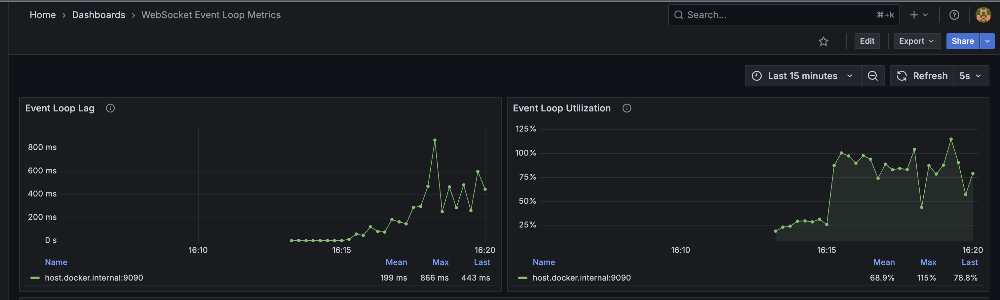
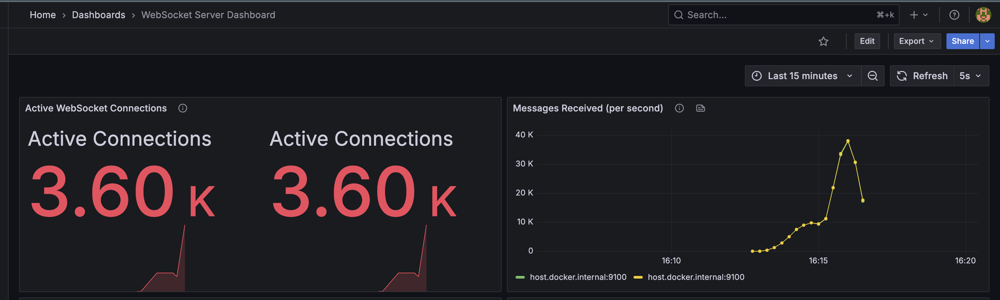

# WebSocket Scalability Demo

A demonstration of WebSocket server scalability with Node.js, including monitoring with Prometheus and Grafana. This project helps identify performance bottlenecks and limitations in WebSocket servers under high load.

## Features

- WebSocket server with connection and message handling
- Client simulator for load testing with configurable parameters
- Event loop lag and CPU utilization monitoring
- Prometheus metrics endpoint for comprehensive data collection
- Custom Grafana dashboards for visualization
- Containerized with Docker for easy deployment
- Graceful error handling and connection management

## Prerequisites

- Node.js 16+
- Docker and Docker Compose (for running the monitoring stack)
- npm or yarn

## Installation

1. Clone the repository:
   ```bash
   git clone https://github.com/yourusername/ws-scalability-demo.git
   cd ws-scalability-demo
   ```

2. Install dependencies:
   ```bash
   npm install
   ```

3. Build the TypeScript code:
   ```bash
   npm run build
   ```

## Running the WebSocket Server

1. Start the WebSocket server:
   ```bash
   npm start
   ```
   This will start the server on port 3000 (default) and expose metrics on port 9100.

2. To run in development mode with auto-reload:
   ```bash
   npm run dev:server
   ```

## Running the Monitoring Stack

The project includes Prometheus and Grafana for monitoring:

1. Start the monitoring stack:
   ```bash
   npm run docker:up
   ```

2. Access Grafana at http://localhost:3001 (default credentials: admin/admin)

3. Open the pre-configured dashboards:
   ```bash
   npm run test:monitor
   ```

## Running Load Tests

### Basic Load Test

Run a basic load test with default parameters:

```bash
npm run test:load
```

### Stress Test

To run a high-load stress test with 100,000 clients:

```bash
npm run test:stress
```

This uses the following parameters:
- 100,000 concurrent WebSocket connections
- 100 messages/second per client (10ms interval)
- 60-second ramp-up period
- 5-minute (300 seconds) test duration
- 100 new connections per second

### Custom Load Test

You can customize the load test parameters:

```bash
ts-node src/load-test.ts --clients=5000 --interval=100 --rampUp=30 --duration=120 --rate=50
```

Parameters:
- `--clients`: Number of WebSocket clients to connect
- `--interval`: Message sending interval in milliseconds
- `--rampUp`: Time (in seconds) to ramp up to full client count
- `--duration`: Total test duration in seconds
- `--rate`: Maximum new connections per second

## Monitoring During Load Tests

1. Watch the event loop metrics dashboard in Grafana to monitor:
   - Event loop lag (should be < 100ms for good performance)
   - CPU utilization
   - Active WebSocket connections
   - Memory usage

2. Monitor connection errors and performance in the console output

## Key Files

- `src/server/server.ts`: WebSocket server implementation
- `src/load-test.ts`: Load test implementation
- `src/client/client.ts`: WebSocket client implementation
- `prometheus/prometheus.yml`: Prometheus configuration
- `grafana/provisioning/dashboards`: Grafana dashboard definitions

## Understanding Results

During high-load scenarios, watch for:

1. **Event Loop Lag**: Indicates JavaScript execution blocking the event loop
2. **Connection Errors**: Shows connection stability issues
3. **Memory Usage**: Helps identify memory leaks or consumption patterns
4. **CPU Utilization**: Indicates processing bottlenecks

## Dashboard Screenshots

### Event Loop Metrics Dashboard



The Event Loop Metrics dashboard shows:
- **Event Loop Lag**: Time (in ms) the event loop is blocked. Higher values indicate potential processing bottlenecks.
- **Event Loop Utilization**: CPU utilization percentage of the Node.js process.

### WebSocket Server Dashboard



The WebSocket Server dashboard shows:
- **Active Connections**: Number of currently connected WebSocket clients.
- **Messages Received**: Rate of messages being processed by the server.

## Troubleshooting

- If connections fail with "WebSocket was closed before the connection was established", try reducing the connection rate or increasing the ramp-up time.
- If you see high event loop lag, consider distributing the load across multiple processes/servers.
- Memory issues? Check for connection objects not being properly cleaned up.

### Accessing the Monitoring Tools

- **Grafana**: http://localhost:3001 (admin/admin)
  - Pre-configured dashboards will be available after starting the services

- **Prometheus**: http://localhost:9090
  - Explore metrics and set up alerts

- **Node Exporter Metrics**: http://localhost:9100
  - System-level metrics (CPU, memory, disk, etc.)

### Manual Setup (Alternative to run.sh)

If you prefer to run the services manually:

1. Start the monitoring stack:
   ```bash
   docker-compose up -d
   ```

2. Install dependencies and build the project:
   ```bash
   npm install
   npm run build
   ```

3. Start the WebSocket server:
   ```bash
   npm run start:server
   ```

4. In a separate terminal, start the client simulator:
   ```bash
   npm run start:client -- --clients=1000 --message-interval=1000
   ```

### Viewing Metrics

- **Server metrics**: http://localhost:9091/metrics
- **Client metrics**: http://localhost:9092/metrics
- **Prometheus UI**: http://localhost:9090
- **Grafana Dashboards**: http://localhost:3001

### Available Dashboards

1. **WebSocket Server Metrics**
   - Active connections
   - Message rates
   - Connection status
   - Error rates

2. **System Metrics**
   - CPU and memory usage
   - Event loop lag
   - File descriptors
   - Network I/O

3. **Client Simulator Metrics**
   - Connection status
   - Message rates
   - Latency percentiles
   - Error rates

### Stopping the Services

To stop all services and clean up:

```bash
docker-compose down
```

## Metrics

The following metrics are exposed by the server and client:

### Server Metrics

- `websocket_active_connections`: Number of active WebSocket connections
- `websocket_messages_received_total`: Total number of messages received
- `websocket_messages_broadcasted_total`: Total number of messages broadcasted
- `websocket_message_processing_seconds`: Time spent processing WebSocket messages
- `node_memory_usage_bytes`: Memory usage in bytes
- `node_eventloop_lag_seconds`: Event loop lag in seconds
- `node_cpu_usage_percent`: CPU usage percentage
- `websocket_connection_errors_total`: Total number of connection errors

### Client Metrics

- `ws_simulator_connections`: Number of active WebSocket connections
- `ws_simulator_messages_sent_total`: Total number of messages sent
- `ws_simulator_messages_received_total`: Total number of messages received
- `ws_simulator_errors_total`: Total number of errors
- `ws_simulator_message_latency_seconds`: Message latency in seconds
- `ws_simulator_connection_duration_seconds`: Duration of WebSocket connections in seconds
- `ws_simulator_message_size_bytes`: Size of WebSocket messages in bytes
- `ws_simulator_reconnect_attempts_total`: Total number of reconnection attempts
- `ws_simulator_bytes_sent_total`: Total number of bytes sent
- `ws_simulator_bytes_received_total`: Total number of bytes received

## Performance Tuning

### System Limits

On Linux/Unix systems, you might need to increase the maximum number of open files:

```bash
# Check current limits
ulimit -n

# Increase limits (temporary)
ulimit -n 100000

# Make it permanent (add to /etc/security/limits.conf)
# * soft nofile 100000
# * hard nofile 100000
```

### TCP Tuning

For high connection counts, you might need to tune TCP settings:

```bash
# Increase the local port range
echo "1024 65000" > /proc/sys/net/ipv4/ip_local_port_range

# Reuse sockets in TIME_WAIT state
echo 1 > /proc/sys/net/ipv4/tcp_tw_reuse

# Increase the maximum number of file descriptors
echo 100000 > /proc/sys/fs/file-max
```

## License

MIT

## Contributing

Contributions are welcome! Please feel free to submit a Pull Request.
